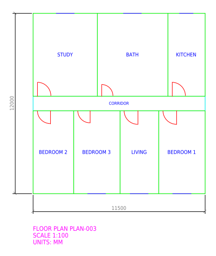
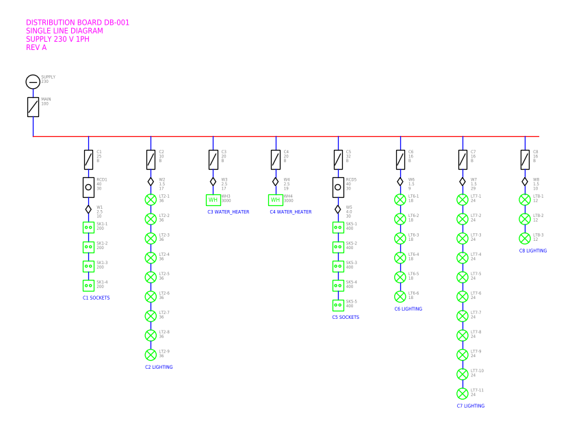
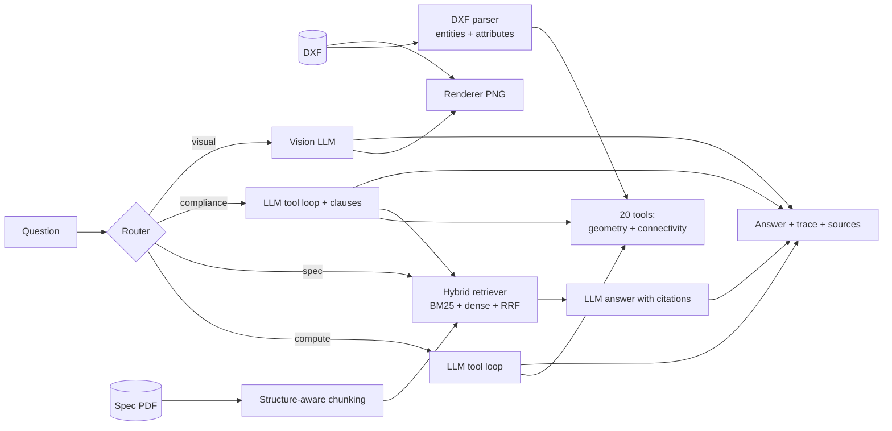

# CAD Copilot

Ask questions about construction drawings in plain English, across **building plans** and **electrical /
electronic schematics**, and check them against specification documents.

*"What is the area of Bedroom 2?"* · *"What is the total load on circuit C3?"* ·
*"Are all socket circuits protected by an RCD as the spec requires?"*

Numbers are **computed by code from the drawing's geometry and wiring**, never guessed by the language model.
Requirements are **retrieved from the specification with clause and page citations**.

<!-- Replace with a GIF of the app: record with ScreenToGif / Kap, save to docs/images/demo.gif -->
<p align="center">
  
  
</p>

**Live demo:** _add your Hugging Face Spaces link here_

---

## Why this project

A construction project produces architectural drawings and electrical drawings, and every one has to be checked
against a specification: room sizes and corridor widths on one side, breaker sizes, circuit loads and RCD
protection on the other. That checking is slow and manual.

LLMs can't do it by reading the files directly. A DXF is thousands of coordinates and group codes; ask a model
to sum a circuit's load or a room's area from that and it produces a confident, wrong number. So CAD Copilot
splits the work:

| Job | Done by |
|---|---|
| Parse geometry, block attributes and wiring | Python (ezdxf + pandas) |
| Areas, widths, counts, ratings, loads, what each breaker feeds | 20 deterministic tools |
| Decide which computation answers the question | LLM via tool calling |
| Find the relevant requirement | Hybrid retrieval (BM25 + embeddings, fused with RRF) |
| Check drawing values against requirements | LLM with tools **and** retrieved clauses together |
| Layout questions ("what's next to the kitchen?") | Vision model on the rendered drawing |

## Supported drawings

| Drawing type | How it is read | Example questions |
|---|---|---|
| Building floor plans | Rooms are labelled closed polylines; doors are blocks; windows are lines on external walls | room areas, corridor width, door widths, windows per room |
| Electrical schematics (distribution boards) | Devices and loads are blocks with attributes (`RATING_A`, `LOAD_W`, `SIZE_SQMM`...); wiring is traced from line geometry | circuit loads, breaker and cable sizes, RCD protection, cable lengths |
| Electronic circuits | Components are blocks with attributes (`VALUE_OHM`, `VALUE_UF`...); nets are traced from wires | part counts, values, what connects to what |
| Mechanical parts | Outlines and circles | hole counts by diameter, plate area |

The drawing type is detected automatically and the matching tools and hints are given to the model.

### How wiring is traced

For schematics, connectivity comes purely from geometry (`cad_copilot/tools/connectivity.py`):
wire segments that touch (shared end points or T-junctions onto a busbar) merge into conductor groups; a component
is attached where a wire end touches its symbol; components sharing a conductor are connected. "Downstream" is
defined by distance from the supply, so `downstream("C3")` returns exactly the RCD, cable and loads that breaker C3
feeds, and never a neighbouring circuit. On all sample drawings this matches the ground truth exactly.

## Architecture



Every answer carries a **trace** (which tools were called, with which arguments, and what they returned) and its
**sources** (exact clauses and pages), shown in the UI under "How this was answered".

## Evaluation

The benchmark has **372 questions** generated from ground truth:

- Each sample drawing is written together with a JSON manifest of its true values (room areas, breaker ratings,
  circuit loads, component connections...). The manifest comes from the generator, not the parser, so it is an
  independent check.
- Compute questions come in two wordings: a *canonical* one and a *paraphrase*.
- Compliance answers (PASS/FAIL) come from the manifests and each spec's rules. Some sample drawings contain
  deliberate faults (oversized breakers, overloaded circuits, missing RCDs, long cable runs, narrow corridors,
  rooms without windows) so every rule has both PASS and FAIL cases.

| Set | Building | Electrical | Electronic | Mechanical |
|---|---|---|---|---|
| Compute | 120 | 72 | 15 | 12 |
| Compliance | 48 | 40 | - | - |
| Spec questions | 30 | 20 | - | - |
| Out-of-scope | 3 | 3 | - | - |
| Visual (manual review) | 6 | 3 | - | - |

### Results

Measured with `make eval` (offline rule-based planner, TF-IDF embeddings):

| | Offline rules | LLM + tools | LLM reading raw DXF |
|---|---|---|---|
| Compute, canonical wording | 100.0% (118/118) | _run `make eval-llm`_ | _run `make eval-llm`_ |
| Compute, paraphrased wording | **14.9% (15/101)** | _run `make eval-llm`_ | _run `make eval-llm`_ |
| Compliance (building + electrical) | 100.0% (88/88)* | _run `make eval-llm`_ | n/a |
| Spec questions | 62.0% (31/50) | _run `make eval-llm`_ | n/a |
| Routing | 94.6% (352/372) | _run `make eval-llm`_ | n/a |

\* The offline compliance checker was written for exactly these nine question types, so this shows the pipeline
works end to end (rule values are extracted from the spec PDF by retrieval, not hard-coded), not that it generalises.

The paraphrase gap is the point: keyword rules are perfect on the wording they were written for and collapse on
anything else ("How many **luminaires**" instead of "How many **lights**"). The LLM column shows how much of that
gap tool calling closes, and the raw-DXF column shows why the tools are needed at all.

Retrieval (TF-IDF fallback; rerun with `sentence-transformers` installed for dense embeddings):

| Spec | Chunking | Chunks | recall@1 | recall@3 | context chars@3 |
|---|---|---|---|---|---|
| Building | fixed 500 chars | 12 | 73% | 97% | 1370 |
| Building | structure-aware | 32 | 73% | 93% | **412** |
| Electrical | fixed 500 chars | 10 | 75% | 100% | 1290 |
| Electrical | structure-aware | 25 | **85%** | 100% | **416** |

Structure-aware chunking matches or beats fixed-size chunks on recall@1 while sending the LLM about a third of the
context, and each chunk carries its section title and clause number, which makes citations reliable.

Run `python -m cad_copilot.eval.run_eval --provider heuristic` to regenerate the full tables, per-domain and
per-template breakdowns and every failure in `eval_results/`.

## What didn't work (and what I learned)

- **Out-of-scope detection with a similarity threshold.** Answerable and unanswerable questions had overlapping
  retrieval scores ("What colour should the front door be?" matches door clauses). The retrieval gate now only
  rejects clearly off-topic questions and the LLM makes the final NOT_FOUND call.
- **A shared embedder silently broke one spec.** When I added the electrical spec, building compliance dropped to
  0%. Both retrievers shared one TF-IDF object, and indexing the second PDF overwrote the first one's vocabulary.
  It only affects the TF-IDF fallback (sentence-transformers has no per-document state), which is why it slipped
  through. Fixed, with a regression test.
- **A word collision in the offline planner.** "How many resistors are in the *circuit*?" returned 0 because
  "circuit" triggered the "count the circuits" rule. Keyword rules keep producing bugs like this, which is the
  argument for the LLM planner.
- **recall@3 flatters big chunks.** With 10–12 fixed chunks, the top 3 cover a quarter of the document, so I report
  recall@1 and context size too.
- **I deliberately did not tune rules to the benchmark.** "What is the door count for this *layout*?" is routed to
  the vision path because "layout" is a visual keyword. Patching that would be overfitting to my own test set.

## Quickstart

```bash
git clone https://github.com/Chandrima2005/cad-copilot.git && cd cad-copilot
python -m venv .venv && source .venv/bin/activate      # Windows: .venv\Scripts\activate
pip install -r requirements-dev.txt
pip install --extra-index-url https://download.pytorch.org/whl/cpu -r requirements-embeddings.txt  # optional, recommended

python -m cad_copilot.samples                  # sample drawings + both spec PDFs (already committed)
python -m cad_copilot.eval.generate_questions  # benchmark questions (already committed)
pytest -q                                      # 31 tests, no API key needed
uvicorn app.server:app --port 8501            # http://localhost:8501
```

(`make data`, `make test`, `make app` do the same on Mac/Linux.)

It works with no API key: offline mode handles fixed question patterns. For free-form questions and vision, copy
`.env.example` to `.env` and set a provider:

```bash
# Gemini via OpenRouter (or any OpenAI-compatible endpoint: OpenAI, Groq, local Ollama)
LLM_PROVIDER=openai   OPENAI_API_KEY=...   OPENAI_BASE_URL=https://openrouter.ai/api/v1   LLM_MODEL=google/gemini-3.8-flash
```

Then `python -m cad_copilot.eval.run_eval --provider openai --raw-baseline` fills in the LLM columns above.

**Your own drawings:** in the workspace click **⬆️ Upload** and drop a DXF (measured by code) or a PDF drawing
(read by the online AI), plus an optional spec PDF. Scanned spec PDFs are read by the online AI too.
For schematics, devices need a `TAG` attribute, and conductors should be on a layer whose name contains
WIRE, BUS, NET or CONDUCTOR.

**JSON API:** the same server exposes it; see `http://localhost:8501/docs`.
**Desktop (offline) copy:** download it from the landing page, unzip, double-click `run.bat` (or `sh run.sh`).
**Docker:** `docker build -t cad-copilot . && docker run -p 7860:7860 --env-file .env cad-copilot`.
See [docs/DEPLOY.md](docs/DEPLOY.md).

## Project structure

```
cad_copilot/
  parsing/      dxf_parser.py (entities, block attributes, domain detection), pdf_parser.py, render.py
  tools/        geometry_tools.py (20 tools + JSON schemas), connectivity.py (wiring graph)
  retrieval/    chunking.py (3 strategies), hybrid.py (BM25 + embeddings + RRF)
  llm/          client.py: OpenAI-compatible tool loop (Gemini via OpenRouter) behind one interface
  agent/        router.py, agent.py (orchestration), heuristic.py (offline planner / baseline)
  eval/         generate_questions.py, metrics.py, run_eval.py
  samples.py              building plans + mechanical parts generator
  samples_electrical.py   distribution boards + electronic circuits generator
  spec_content.py         the two fictional specs, their rules and QA pairs
app/            server.py (web app + JSON API), web/ (HTML/CSS/JS), run_desktop.py (desktop launcher)
tests/          parser, tools, schematics, retrieval, router, agent (incl. a fake LLM for the tool loop)
data/           samples/ (27 drawings, 2 spec PDFs), previews/ (pre-rendered images), eval/questions.jsonl
```

## Limitations

- Polyline areas ignore arc segments (bulges); exact for straight-walled rooms.
- Door-to-room mapping assumes door blocks open towards local +x/+y, as the sample DOOR block does.
- Wiring is traced from line geometry. Real schematics that join wires only by net labels (no drawn connection),
  or draw wires ending near but not on a symbol, need an extra net-label step or a larger tolerance.
- Schematic devices must carry a TAG attribute; direction ("downstream") needs a supply block.
- DWG files must be converted to DXF first (e.g. ODA File Converter).
- The specs are fictional and the drawings synthetic. Real drawings are messier: unclosed rooms, labels outside
  boundaries, inconsistent layer and attribute names.

## Roadmap

- Test on real public DXF plans and schematics and document where parsing breaks
- Net-label support for schematics; three-phase boards
- Revision comparison: "what changed between rev A and rev B?"
- Compare a small local model (Ollama) against an API model on accuracy, latency and cost per question

## License

MIT. The sample specifications are fictional and are not real codes or standards.
